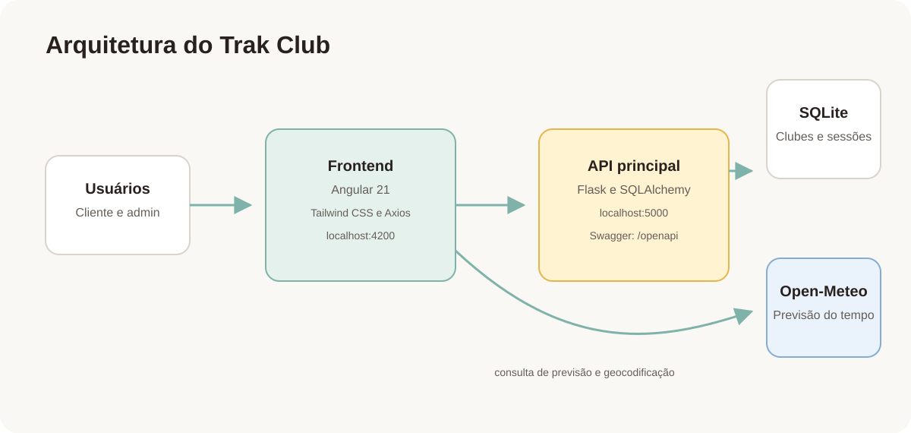

# Trak Club

O Trak Club é uma plataforma web para descobrir opções locais de esportes ao ar livre. Organizadores podem cadastrar e gerenciar as informações dos seus clubes e sessões disponíveis; clientes podem navegar por clubes e atividades semanais em uma interface responsiva.

## Funcionalidades

- Cadastro, edição e exclusão de clubes e suas sessões para o perfil de administrador.
- Visualização de clubes, filtros por estado e atividade, e detalhes de cada clube.
- Agenda semanal de sessões em formato de calendário ou lista.
- Previsão do tempo para os próximos dias, baseada na localização atual do usuário ou em uma cidade pesquisada.
- Perfis de cliente e administrador, com ações disponíveis conforme o perfil.

## Arquitetura



O frontend Angular é executado no navegador e consome a API Flask. A API persiste clubes e sessões em SQLite e expõe sua documentação no Swagger. Para a previsão, o frontend consulta a API pública Open-Meteo.

## Tecnologias

- Angular 21, TypeScript, Tailwind CSS e Axios
- Python, Flask, Flask-OpenAPI3 e SQLAlchemy
- SQLite
- Open-Meteo
- Docker e Docker Compose

## Estrutura do projeto

```text
.
├── postgrad-mvp3-front/  # Aplicação Angular
├── postgrad-mvp3-back/   # API Flask e banco SQLite
├── docs/                 # Diagrama de arquitetura
└── docker-compose.yml    # Execução integrada dos componentes
```

## Pré-requisitos

Para executar localmente sem Docker, instale:

- Node.js 22 ou superior e npm
- Python 3.11 ou superior

Para executar em containers, instale Docker Desktop, que já inclui o Docker Compose.

## Execução local

### 1. Inicie a API

```bash
cd postgrad-mvp3-back
python3 -m venv .venv
source .venv/bin/activate
pip install -r requirements.txt
flask --app app run --host 0.0.0.0 --port 5000
```

A API estará disponível em `http://localhost:5000`. A documentação Swagger pode ser acessada em `http://localhost:5000/openapi`.

### 2. Inicie o frontend

Em outro terminal:

```bash
cd postgrad-mvp3-front
npm install
npm start
```

Abra `http://localhost:4200` no navegador. O frontend espera a API em `http://127.0.0.1:5000`.

## Execução com Docker

Na raiz do projeto, execute:

```bash
docker compose up --build
```

Os serviços estarão disponíveis em:

- Aplicação: `http://localhost:4200`
- API: `http://localhost:5000`
- Swagger: `http://localhost:5000/openapi`

Os dados SQLite são mantidos no volume Docker `trak-club-data`. Para encerrar os containers, use `docker compose down`. Para remover também os dados persistidos, use `docker compose down -v`.

## API

A documentação interativa de todos os endpoints da API principal pode ser consultada pelo Swagger, em `http://localhost:5000/openapi`.
